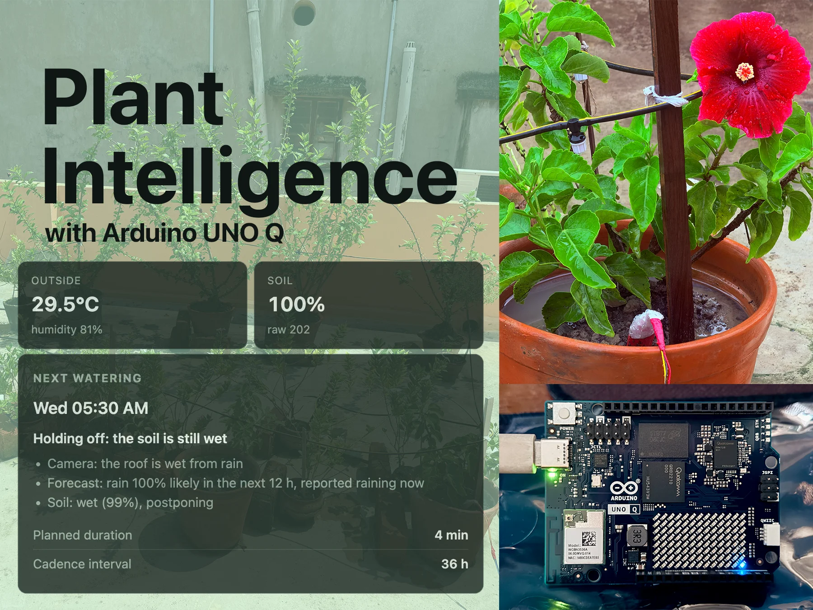
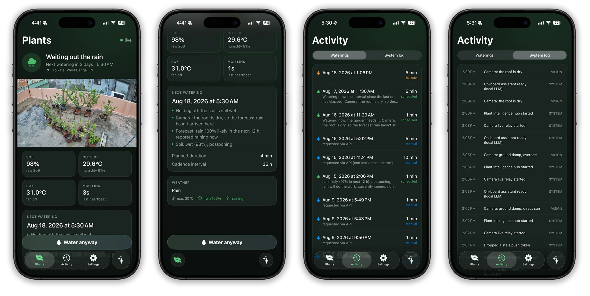
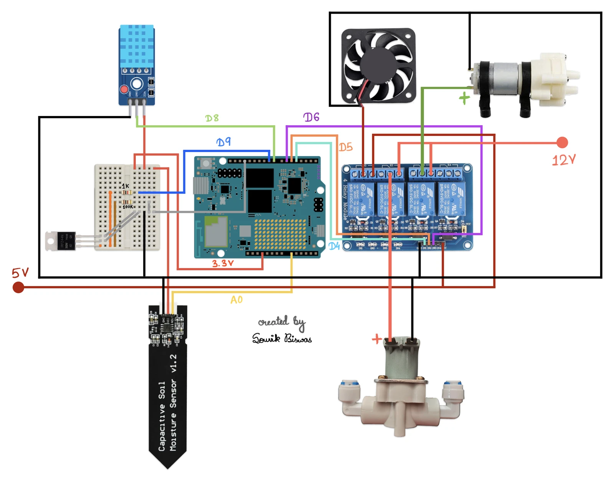
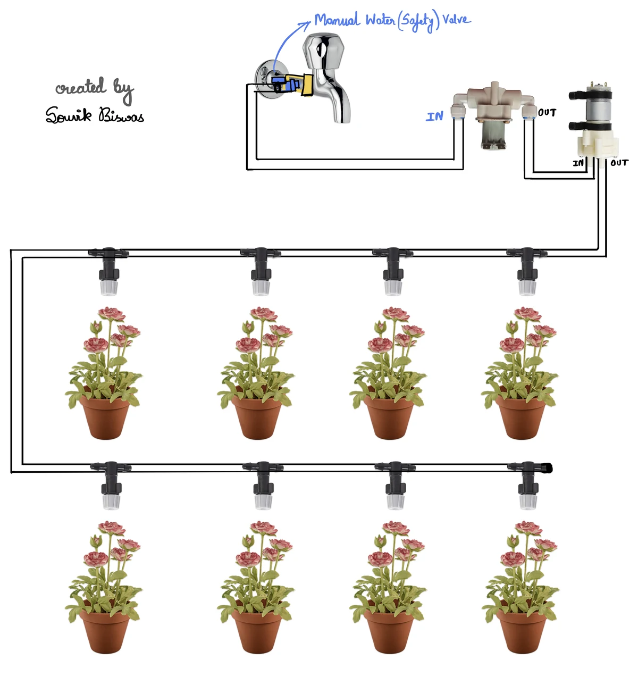

# Plant Intelligence

Plant Intelligence is the watering system I built for my rooftop garden around the Arduino UNO Q. Instead of following a blind timer, it uses soil moisture, live weather, recent watering history and a rooftop camera to decide when to water and for how long.



## What it does

- Builds an adaptive watering plan from sensor readings, weather and camera observations
- Safely controls a pump, solenoid valve and enclosure fan
- Keeps the essential safeguards running on the microcontroller if Linux or Wi-Fi goes down
- Includes a local web dashboard, an iPhone app, an Apple Watch app, widgets, Live Activities and push notifications
- Mirrors plant data to Firestore for approved users when they are away from the home network
- Explains why it chose to water, postpone or skip a cycle

## Architecture

The UNO Q's two processors have separate jobs:

- The STM32 microcontroller reads the DHT11 and soil probe, controls the relays, runs the fan thermostat and enforces the watering safety limits.
- The Linux side handles planning, weather, camera analysis, the assistant, SQLite storage, the web dashboard, the local API and the Firestore mirror.

```text
Soil probe + DHT11       Tapo camera + weather
          |                       |
          v                       v
      STM32 MCU       ⇄       Linux computer
          |                       |
  pump, valve, fan       plan, history, API
                                  |
                    dashboard, iPhone, Watch
                                  |
                    Firestore mirror and APNs
```

The valve opens 750 ms before the pump starts, and the pump stops one second before the valve closes. Watering has a hard 10 minute limit. Linux sends a heartbeat every 30 seconds; after 14 hours without one, the microcontroller can run a conservative five minute failsafe cycle and will still keep at least ten hours between cycles.

## Watering decisions

The planner considers soil moisture, temperature, humidity, forecast rain, recent watering and what the camera can see on the rooftop. The camera is useful when a city-wide forecast does not match the actual garden, such as rain nearby while the roof is still dry.

Every plan includes its reasons, so the dashboard and apps can show why watering is due or why it is being held back. Before the soil probe is installed and calibrated, the system can use simple 07:00 and 17:00 fallback slots.

## Dashboard and Apple apps



The dashboard is served directly by the UNO Q at `http://plantintelligence.local:7000`. It shows the current conditions, camera feed, next watering decision, history, system log and assistant.

The native iPhone and Apple Watch apps provide the same essential status and controls in a smaller form. The iPhone app also includes the camera, assistant, home screen widgets, Live Activities, haptics and watering notifications.

On the home network, the app talks directly to the hub. Away from home, approved users sign in with Google and can read status, history and logs or send water and stop commands through Firestore. Access is restricted by Firebase UID. The live camera and assistant remain local-network features. Notifications are sent directly from the hub through APNs and do not depend on Firestore.

## Hardware and wiring

The current build uses:

- Arduino UNO Q
- DHT11 temperature and humidity sensor
- Capacitive soil moisture probe with an IRLZ44N power switch
- Active-low four-channel relay module
- 12 V water pump, solenoid valve and cooling fan
- Tapo C520WS camera
- Two irrigation lines with adjustable misting nozzles

- Fan relay: D4
- Valve relay: D5
- Pump relay: D6
- DHT11 data: D8
- Soil probe power: D9 through IRLZ44N
- Soil probe signal: A0



[Open the full-resolution wiring PDF](docs/plant-intelligence-wiring.pdf)

The analog inputs are 3.3 V only. All supplies must share a common ground, and the pump should never be run dry. Use a suitably rated external supply for the 12 V loads rather than powering them from the UNO Q.

## Irrigation layout



Water flows from the tap through a manual safety valve, the normally closed solenoid valve and the pump, then into a two-line nozzle loop. The manual valve provides a physical shutoff, while the solenoid prevents gravity-fed water from continuing after the pump stops.

## Running it

1. Build the low-voltage wiring and irrigation line using the diagrams above.
2. Import the [`hub`](hub/) app into Arduino App Lab and press Run. App Lab flashes the sketch and starts the Python service.
3. Open `http://plantintelligence.local:7000` and configure the location, soil calibration, camera and optional assistant.
4. For the Apple apps, open [`mobile/ios`](mobile/ios/), run `xcodegen generate`, then open `PlantIntelligence.xcodeproj` and select your signing team.
5. Remote access is optional. Firebase rules, indexes and setup notes are in [`cloud`](cloud/README.md).

Secrets and the local database live under `hub/data/`, which is excluded from Git.

## Repository

```text
hub/          Arduino App Lab application, firmware, API and dashboard
mobile/ios/   iPhone, Apple Watch, widgets and Live Activity
cloud/        Firestore rules, indexes and remote access setup
docs/         Architecture notes, diagrams and project media
```
